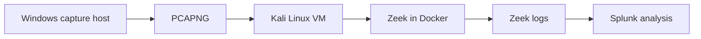

# Cybersecurity Homelab

## Overview

This page documents the verified environment supporting the public Zeek-to-Splunk project. It separates implemented components from planned integrations so the portfolio does not imply telemetry or controls that are not yet demonstrated publicly.

## Current architecture

## Implemented components

| Component | Role | Public evidence |
|---|---|---|
| Windows with Wireshark/Npcap | Network-packet collection | Screenshots and workflow notes in SocLab |
| VirtualBox/Kali Linux | Isolated analysis environment | Connectivity and troubleshooting evidence |
| Dockerized Zeek | Converts PCAP data into structured network telemetry | Reproducible Docker/Zeek commands |
| Splunk | Ingests, parses, searches, and summarizes Zeek connection data | SPL, screenshots, findings, and investigation report |

## Data handling

The public repository does not publish the raw PCAP or generated Zeek logs. Public evidence is limited to documentation, queries, observations, and screenshots. Production credentials, public IP attribution, and sensitive packet payloads do not belong in this portfolio.

## Planned integrations

- Windows endpoint and authentication telemetry
- Microsoft Sentinel and Azure Log Analytics
- Vulnerability and asset inventory data
- Time-bounded threat-intelligence enrichment
- Remediation ownership and SLA tracking

Planned components should move into the implemented table only after evidence, detection logic, and limitations are published.

See the [telemetry map](telemetry-map.md) for the questions each data source can answer.
