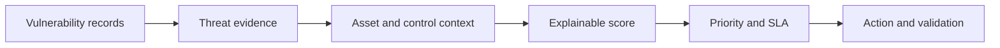

# Threat-Informed Exposure Prioritization Engine

> A transparent Python model that ranks synthetic vulnerability exposures using threat evidence, asset context, control coverage, age, ownership, and remediation SLAs—not CVSS alone.

## Objective and executive snapshot

| Area | Detail |
|---|---|
| Decision | Which exposures should be investigated or remediated first? |
| Analyst role | Define a data contract, implement explainable scoring, generate ranked output, and test expected behavior |
| Inputs | Synthetic vulnerability, exploitation, intelligence, asset, reachability, privilege, control, age, owner, and status fields |
| Output | Priority score/band, SLA, SLA-breach flag, reasons, and recommended action |
| Safety | All assets and exposure records are fictional |
| Limitation | The model supports prioritization; it does not replace analyst judgment or a production risk methodology |

## Problem statement

A high CVSS score does not automatically represent the most urgent business exposure. A lower-severity issue may deserve earlier action when exploitation is active, the asset is externally reachable or privileged, controls are weak, and the affected service is critical.

This project makes that reasoning visible and testable.

## Decision flow



## Scoring model

| Factor | Maximum points |
|---|---:|
| CVSS severity | 15 |
| Asset criticality | 15 |
| Known exploited vulnerability | 20 |
| Active exploitation intelligence | 15 |
| External reachability | 10 |
| Privileged identity/system | 5 |
| Missing control coverage | 10 |
| Exposure age | 5 |
| Intelligence confidence | 5 |
| **Total** | **100** |

The full rationale, assumptions, and governance cautions are in the [methodology](docs/methodology.md).

## Run the project

Requirements: Python 3.10 or later; no third-party packages.

```bash
python src/prioritize_exposures.py data/sample_exposures.csv output/prioritized_exposures.csv
python -m unittest discover -s tests -v
```

## Output fields

The ranked [sample output](output/prioritized_exposures.csv) adds:

- `priority_score`
- `priority_band`
- `remediation_sla_days`
- `sla_breached`
- `score_reasons`
- `recommended_action`

See the [data dictionary](docs/data_dictionary.md) for input validation rules.

## Analyst interpretation

The highest-ranked record should not be described merely as “the highest CVSS.” Its priority is explainable through the combination of exploitation evidence, critical asset context, reachability, weak controls, privilege, and age. A remediated record remains visible until closure is validated.

## Metrics for a dashboard

- Critical/high exposures by business service and owner
- Known-exploited or actively exploited exposures
- Externally reachable exposures with weak control coverage
- SLA breaches and exposure age
- Exceptions approaching review date
- Remediated items awaiting validation

## Limitations

- The weights are a documented demonstration model, not an organizational risk standard.
- Inputs are synthetic and do not represent Regions Bank or any real company.
- The model assumes trustworthy scanner, CMDB, control, and intelligence data.
- Business owners must review exceptions and remediation feasibility.
- Production deployment requires calibration, access controls, audit history, and monitoring.

## Connection to cybersecurity analyst work

This project demonstrates CTI-to-exposure correlation, risk-based remediation prioritization, transparent automation, SLA reporting, quality validation, and concise communication to technical and leadership audiences.
